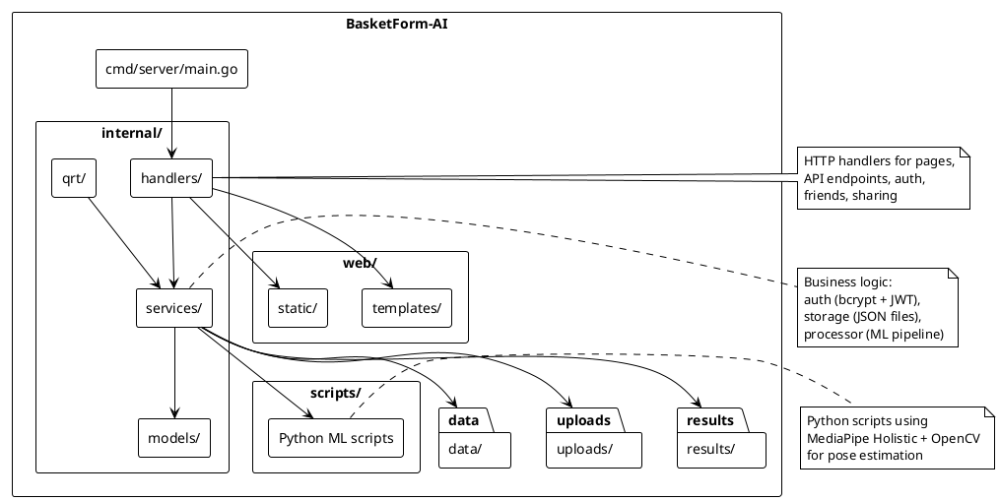
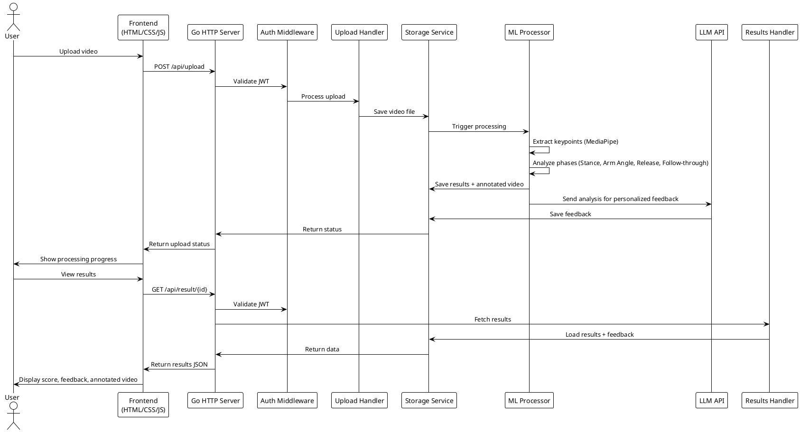
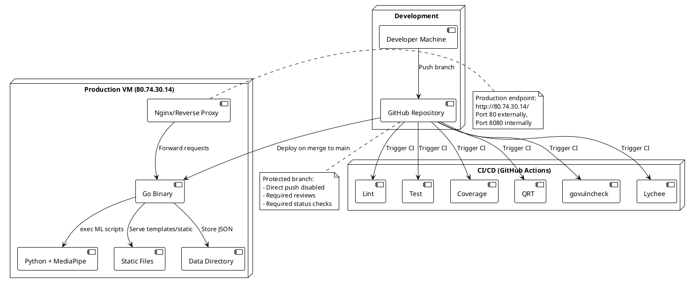

# Architecture Documentation

This directory contains the maintained architecture documentation for BasketForm-AI, using diagrams-as-code (PlantUML).

## Views

### Static View — Component and Package Structure

The static view shows the system's structural organization: components, their responsibilities, and relationships.

**Source:** [static-view.puml](static-view.puml)
**Rendered:** See [static-view.svg](static-view.svg)

### Dynamic View — Request Flow and ML Pipeline

The dynamic view shows how a user request flows through the system, from upload to feedback delivery.

**Source:** [dynamic-view.puml](dynamic-view.puml)
**Rendered:** See [dynamic-view.svg](dynamic-view.svg)

### Deployment View — VM Deployment and CI/CD

The deployment view shows how the system is deployed and how changes flow from development to production.

**Source:** [deployment-view.puml](deployment-view.puml)
**Rendered:** See [deployment-view.svg](deployment-view.svg)

## Key Architecture Decisions

Architecture Decision Records (ADRs) are maintained in this directory. See individual ADR files for detailed rationale.

| ADR | Decision | Rationale |
|-----|----------|-----------|
| ADR-001 | Go standard library for backend | Simplicity, no framework dependencies, easy deployment |
| ADR-002 | JSON file storage | Simple persistence without database overhead for MVP |
| ADR-003 | MediaPipe for pose estimation | Pre-trained model, good accuracy, Python integration |
| ADR-004 | JWT with HttpOnly cookies | Security (XSS protection), stateless auth |
| ADR-005 | LLM API for feedback | Personalized coaching-style feedback without custom ML |

## How to Maintain

1. When code structure changes, update the static view
2. When request flows change, update the dynamic view
3. When deployment changes, update the deployment view
4. When key decisions change, create a new ADR
5. Keep PlantUML sources in the repository and render SVGs before merging
