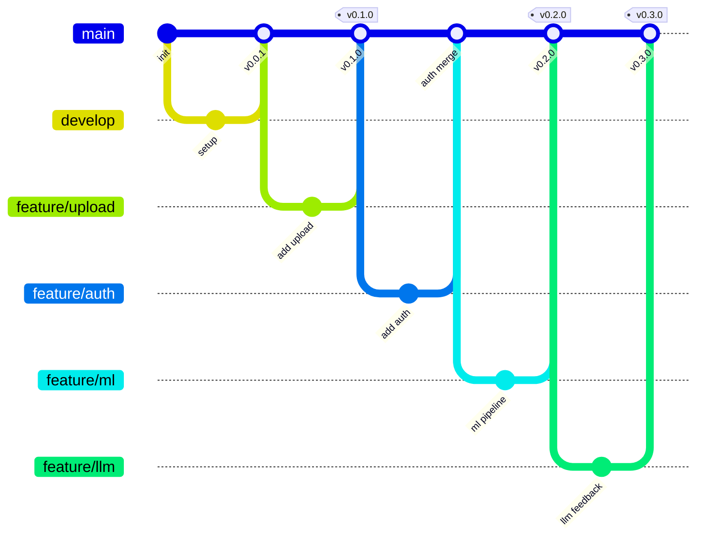

# Development Process and Configuration Management

This document describes the team's development workflow, branching strategy, code review process, and configuration management practices.

## Git Workflow

The team follows a trunk-based development model with short-lived feature branches. All changes go through Pull Requests (PRs) with required reviews before merging to the protected `main` branch.

### Branching Strategy

### What the Diagram Shows

The gitGraph above illustrates the team's branching and merging pattern:

1. **Protected `main` branch**: All releases branch from and merge back to `main`. Direct pushes to `main` are disabled; all changes require a Pull Request.

2. **Short-lived feature branches**: Each feature or fix gets its own branch (e.g., `feature/upload`, `feature/auth`, `feature/ml`). Branches are named `<type>/<short-description>`.

3. **Release tags**: SemVer tags (`v0.1.0`, `v0.2.0`, `v0.3.0`) mark release points on `main`. Each tag maps to a Sprint milestone and a course MVP increment.

4. **Merge commits**: Feature branches merge back to `main` via merge commits (no squash or rebase). Each merge requires at least one approval from a different team member.

### How the Team Uses This Workflow

- **Issue-linked branching**: Every non-automated change starts from a GitHub issue. The branch is created from the issue page and named `<issue-number>-<short-description>`.
- **PR/MR process**: Changes are submitted through Pull Requests. The PR template prompts for summary, testing performed, related issue, acceptance criteria verification, and changelog checklist.
- **Required reviews**: At least one team member must approve the PR before merge. Authors cannot approve their own PRs.
- **CI checks**: All PRs must pass CI (lint, test, coverage, QRT, govulncheck) before merge.
- **Changelog**: User-visible changes include a CHANGELOG.md entry in the `[Unreleased]` section.

## Branch Protection

The default branch `main` is protected with repository rulesets:

- Direct pushes are disabled
- Pull requests are required for all changes
- At least one approval is required
- Status checks must pass (CI pipeline)
- Authors cannot approve their own PRs

Evidence: [Repository rules](https://github.com/kr1ny77/BasketForm-AI/rules)

## Code Review Process

1. Developer creates a branch from the related issue
2. Implements changes and pushes to the feature branch
3. Opens a Pull Request with:
   - Summary of changes
   - Related issue link
   - Testing performed
   - Acceptance criteria verification
   - Changelog checklist (Added/Updated or Not applicable)
4. At least one other team member reviews and approves
5. CI checks pass
6. PR is merged to `main` via merge commit

## Configuration Management

### Environment Variables

Configuration is managed through environment variables with sensible defaults:

| Variable | Default | Description |
|----------|---------|-------------|
| `PORT` | `8080` | Server port |
| `UPLOAD_DIR` | `uploads` | Video upload directory |
| `RESULTS_DIR` | `results` | Analysis results directory |
| `DATA_DIR` | `data` | JSON storage directory |
| `JWT_SECRET` | default | JWT signing secret |

### Secrets Management

- `.env` files are gitignored and never committed
- `.env.example` is committed with sanitized defaults
- Production secrets are set directly on the deployment server
- No credentials or secrets are committed to the repository

### Dependencies

- Go dependencies are managed via `go.mod` and `go.sum` (committed)
- Python dependencies are managed via `requirements.txt` (committed)
- Dependency lockfiles are committed for reproducibility

### Deployment Configuration

- `Dockerfile` is committed for containerized deployment
- Deployment scripts are in `scripts/` directory
- Production runs on the VM at http://80.74.30.14/

## CI/CD Pipeline

The GitHub Actions CI pipeline runs on every PR and push to `main`:

1. **Lint**: `golangci-lint` for Go code quality
2. **Test**: `go test -race -coverprofile` for unit and integration tests
3. **Coverage**: 30% minimum for critical modules (handlers, services)
4. **QRT**: Quality requirement tests (`go test -tags=qrt`)
5. **Security**: `govulncheck` for vulnerability scanning
6. **Link Check**: Lychee for Markdown link validation

## Sprint Process

1. **Sprint Planning**: Select PBIs from the Product Backlog, assign to Sprint milestone
2. **Development**: Feature branches, PRs, code review, CI checks
3. **Sprint Review**: Demo to customer, gather feedback
4. **Sprint Retrospective**: Process improvement
5. **Release**: SemVer tag, CHANGELOG update, deployment

## Traceability

- Issues link to PBIs and user stories
- PRs link to issues
- Sprint milestones contain selected PBIs
- CHANGELOG entries link to issues
- Documentation in `docs/` is maintained alongside code

## Hosted Documentation

This document is linked from:
- Root [README.md](../README.md)
- [Week 5 Public Report](../reports/week5/README.md)
- Hosted documentation site (when available)
