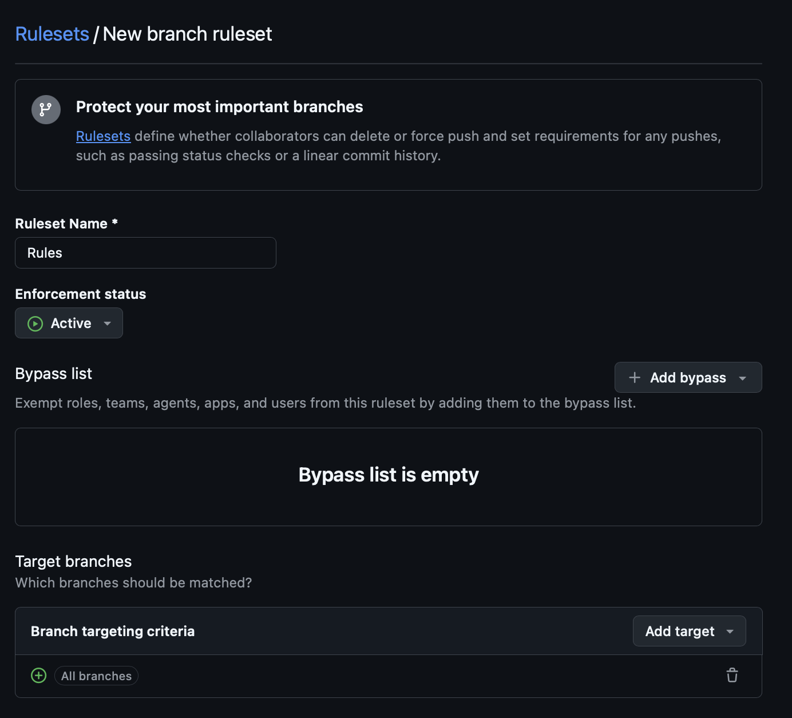
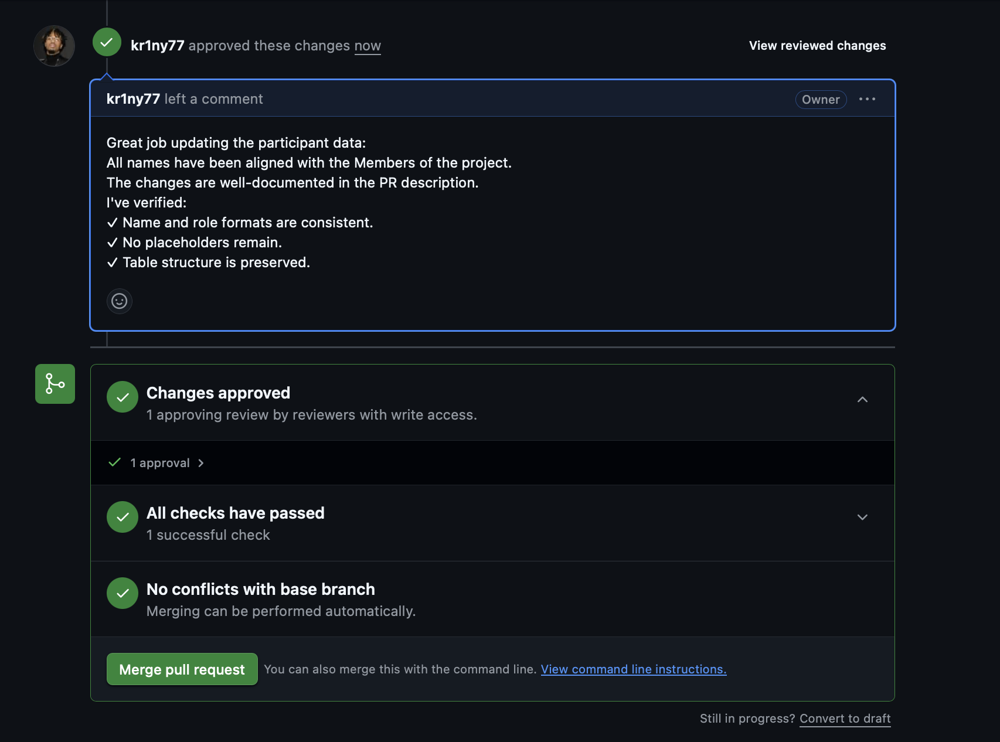
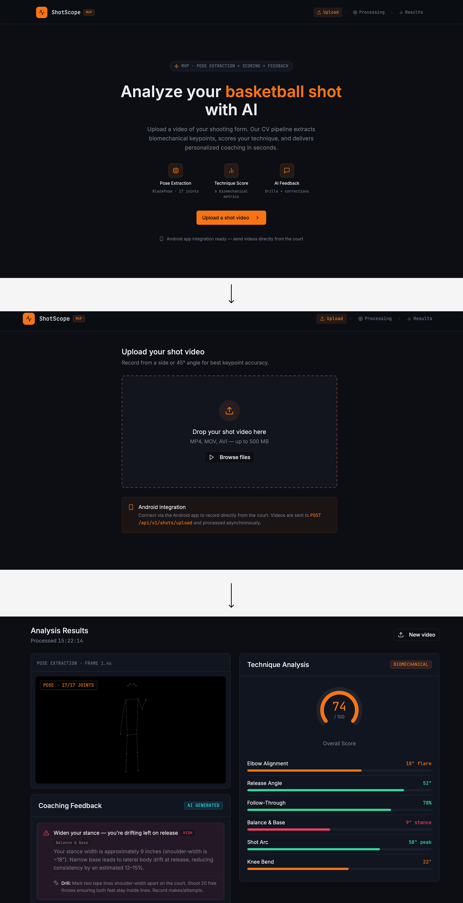
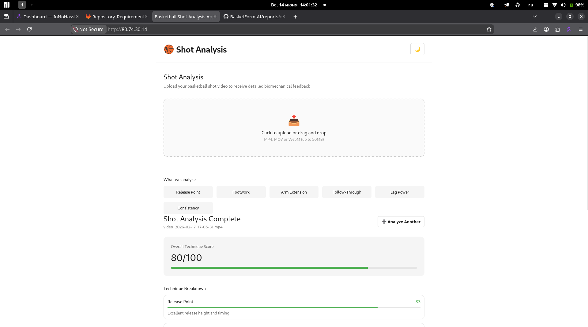

# Assignment 2: BasketForm-AI

## Project Information

- **Project Name:** BasketForm-AI
- **Description:** Website with a backend service for recording and uploading basketball shot videos, extracting biomechanical keypoints, evaluating shooting technique, and generating personalized feedback.
- **License:** [MIT License](../../LICENSE)
- **Repository:** [https://github.com/kr1ny77/BasketForm-AI](https://github.com/kr1ny77/BasketForm-AI)

## Required Artifacts

### User Stories
- [User Stories and MoSCoW Priorities](user-stories.md)

### Interface Design
- **Interactive Prototype:** [Figma Prototype](https://www.figma.com/proto/PLACEHOLDER)
- **Interface Documentation:** [docs/interface.md](../../docs/interface.md)

### MVP v0
- [MVP v0 Report](mvp-v0-report.md)
- **Deployment URL:** [https://mvp-v0.example.com](https://mvp-v0.example.com)
- **Video Demonstration:** [Video Link](https://youtu.be/PLACEHOLDER)

### Customer Review
- [Customer Meeting Summary](customer-meeting-summary.md)
- [Customer Meeting Transcript](customer-meeting-transcript.md)

### Analysis and Reports
- [Week 2 Analysis](analysis.md)
- [LLM Usage Report](llm-report.md)

## Repository Setup

### Branch Protection
- Default branch (`main`) is protected
- Direct pushes disabled
- Required approvals: 1
- PR template: [`.github/pull_request_template.md`](../../.github/pull_request_template.md)

### Lychee Link Checking
- Configuration: [`.lycheeignore`](../../.lycheeignore)
- Latest successful run: [Link to CI run](https://github.com/kr1ny77/BasketForm-AI/actions)

### Excluded Links
- [List of excluded links with justification](#excluded-links)

## Screenshots

### Protected Branch Settings

### Example Reviewed PR

### Figma Prototype

### MVP v0 Deployment

## Coverage

### Prototype Coverage
The interactive prototype covers the following user stories:
- US-01: Video upload and recording
- US-02: Biomechanical keypoint extraction
- US-03: Shooting technique evaluation
- US-04: Personalized feedback generation

### MVP v0 Coverage
MVP v0 establishes the technical foundation for:
- US-01: Video upload and recording (partial implementation)
- US-02: Biomechanical keypoint extraction (backend service)
- US-03: Shooting technique evaluation (API endpoint)
- US-04: Personalized feedback generation (placeholder)

For detailed smoke-check scenario, see [MVP v0 Report](mvp-v0-report.md).

## Team Contributions

| Team Member | Role | Responsibilities | Contributions |
|-------------|------|------------------|---------------|
| [Name] | Product Owner | Product management | User stories, customer review |
| [Name] | Scrum Master | Process management | Sprint planning, documentation |
| [Name] | Developer | Frontend | Figma prototype, UI implementation |
| [Name] | Developer | Backend | API development, MVP v0 deployment |

## Links

- [Root README](../../README.md)
- [Repository Requirements](../../Repository_Requirements.md)
- [Assignment 2 Instructions](../../Assignment_02.md)