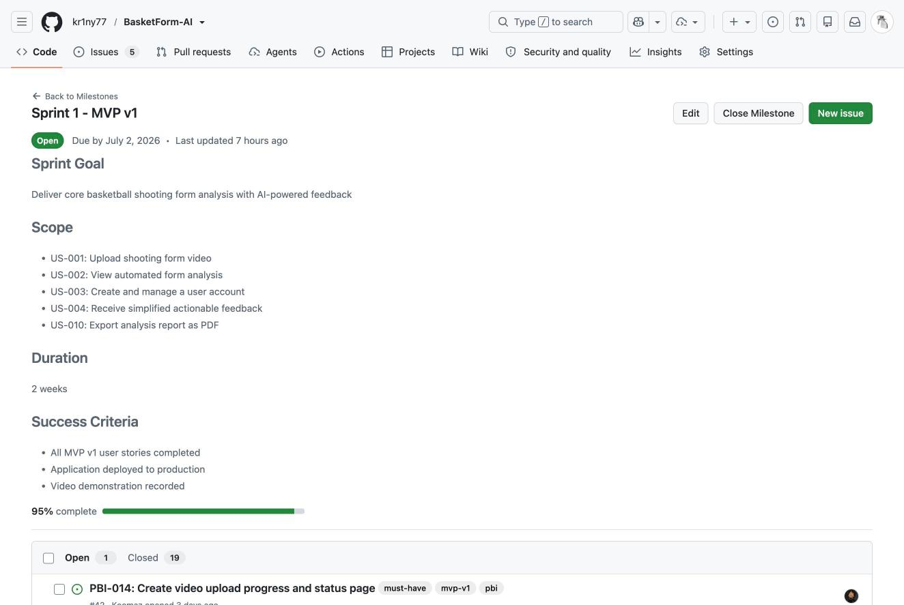
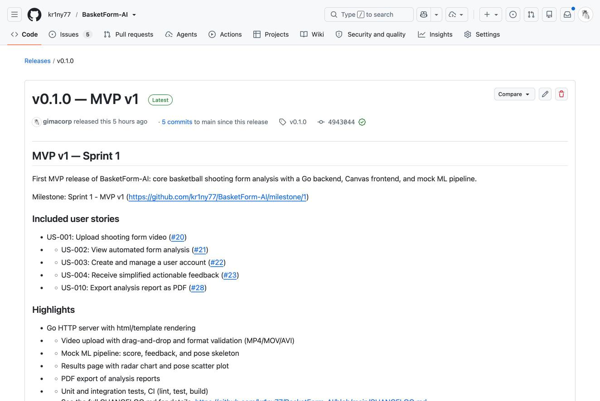
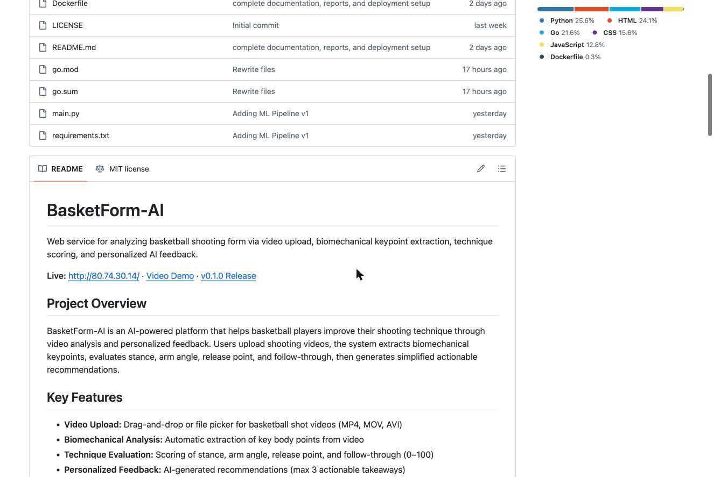

# Week 3 Report - Assignment 3

## Project Information

**Project Name:** BasketForm-AI
**Description:** AI-powered basketball shooting form analysis platform
**License:** [MIT License](../../LICENSE)

## Team Members

| Name | GitHub Username | Role |
|------|-----------------|------|
| Roman Santalov | romasntlv | Developer |
| Kamil Nizamov | Koomaz | Developer |
| Arseniy Fedorov | [GitHub Username] | Developer |
| Karim Gimadiev | [GitHub Username] | Developer |
| Damir Galiev | [GitHub Username] | Developer |

## Summary of Scope Changes

Since Assignment 2, the following changes have been made to the user-story and PBI scope:

- **Migrated user stories** from `reports/week2/user-stories.md` to GitHub Issues
- **Created Product Backlog** with 15+ qualifying PBIs
- **Defined MVP v1 scope** including US-001, US-002, US-003, US-004, and US-010
- **Added supporting PBIs** for technical infrastructure, testing, and documentation

## Customer Feedback Addressed in MVP v1

Based on the customer meeting from Assignment 2, the following feedback points have been addressed:

1. **Video upload with format guidance** - Added camera positioning guides
2. **Simplified feedback** - Maximum 3 actionable takeaways per analysis
3. **PDF export** - Added for offline record keeping
4. **User accounts** - For saving analysis history

## Links to Key Artifacts

### User Stories and Backlog
- [Historical User Stories (Assignment 2)](../week2/user-stories.md)
- [Current User Stories Index](../../docs/user-stories.md)
- [Product Backlog Board](https://github.com/kr1ny77/BasketForm-AI/projects) (GitHub Projects)
- [Sprint Backlog Board](https://github.com/kr1ny77/BasketForm-AI/projects) (GitHub Projects)

### Sprint and Milestones
- [Sprint 1 Milestone](https://github.com/kr1ny77/BasketForm-AI/milestone/1)
- [MVP v1 Scope](https://github.com/kr1ny77/BasketForm-AI/issues?q=milestone%3A1+label%3Amvp-v1)

### Documentation
- [Process Requirements](../../Process_Requirements.md)
- [Roadmap](../../docs/roadmap.md)
- [Definition of Done](../../docs/definition-of-done.md)
- [CHANGELOG](../../CHANGELOG.md)

### Workflow Evidence
- [Issue Templates](https://github.com/kr1ny77/BasketForm-AI/tree/main/.github/ISSUE_TEMPLATE)
- [PR Template](https://github.com/kr1ny77/BasketForm-AI/blob/main/.github/pull_request_template.md)
- [Reviewed PRs](https://github.com/kr1ny77/BasketForm-AI/pulls?q=is%3Apr+is%3Amerged)

### Deployment and Access
- [MVP v1 Deployment](http://80.74.30.14/)
- [Run Instructions](../../README.md#local-development-setup)
- [Video Demonstration](https://youtu.be/To_1ZwAMe4M)

## Product Backlog Size

- **Total Product Backlog Size:** [X] Story Points
- **Current Sprint Size:** [Y] Story Points

## MVP v1 Scope Description

MVP v1 focuses on delivering the core basketball shooting form analysis functionality:

1. **Video Upload (US-001):** Users can upload basketball shooting videos
2. **Automated Analysis (US-002):** System extracts biomechanical keypoints and evaluates shooting technique
3. **User Accounts (US-003):** Users can create accounts to save their analysis history
4. **Personalized Feedback (US-004):** System generates simplified, actionable feedback
5. **PDF Export (US-010):** Users can export analysis reports as PDF

## PBI Types, Statuses, and Priorities

- **User Stories:** US-001 to US-010 with MoSCoW priorities
- **Technical PBIs:** Backend setup, database, authentication
- **Testing PBIs:** Unit tests, integration tests
- **Documentation PBIs:** API docs, user guides

## Verification Evidence

All MVP v1 PBIs include:
- Acceptance criteria in issue descriptions
- PR/MR links for code changes
- Test results and coverage reports
- Deployment verification

## Current Product Status

- **MVP v0:** Deployed and functional
- **MVP v1:** In development - Sprint 1
- **Backend:** FastAPI setup in progress
- **Frontend:** React application structure created
- **AI/ML:** MediaPipe integration planned

## Next Steps

1. Complete Sprint 1 implementation
2. Deploy MVP v1 to production
3. Record video demonstration
4. Conduct Sprint Review with customer
5. Plan Sprint 2 for comparison features

## Contribution Traceability

| Team Member | Issues | PRs | Reviews |
|-------------|--------|-----|---------|
| Roman Santalov | [Issues](https://github.com/kr1ny77/BasketForm-AI/issues?q=assignee%3Aromasntlv) | [PRs](https://github.com/kr1ny77/BasketForm-AI/pulls?q=author%3Aromasntlv) | [Reviews](https://github.com/kr1ny77/BasketForm-AI/pulls?q=reviewed-by%3Aromasntlv) |
| Kamil Nizamov | [Issues](https://github.com/kr1ny77/BasketForm-AI/issues?q=assignee%3AKoomaz) | [PRs](https://github.com/kr1ny77/BasketForm-AI/pulls?q=author%3AKoomaz) | [Reviews](https://github.com/kr1ny77/BasketForm-AI/pulls?q=reviewed-by%3AKoomaz) |
| Arseniy Fedorov | [Issues](https://github.com/kr1ny77/BasketForm-AI/issues?q=assignee%3A[username]) | [PRs](https://github.com/kr1ny77/BasketForm-AI/pulls?q=author%3A[username]) | [Reviews](https://github.com/kr1ny77/BasketForm-AI/pulls?q=reviewed-by%3A[username]) |
| Karim Gimadiev | [Issues](https://github.com/kr1ny77/BasketForm-AI/issues?q=assignee%3A[username]) | [PRs](https://github.com/kr1ny77/BasketForm-AI/pulls?q=author%3A[username]) | [Reviews](https://github.com/kr1ny77/BasketForm-AI/pulls?q=reviewed-by%3A[username]) |
| Damir Galiev | [Issues](https://github.com/kr1ny77/BasketForm-AI/issues?q=assignee%3A[username]) | [PRs](https://github.com/kr1ny77/BasketForm-AI/pulls?q=author%3A[username]) | [Reviews](https://github.com/kr1ny77/BasketForm-AI/pulls?q=reviewed-by%3A[username]) |

## SemVer Release

- **MVP v1 Release:** [v1.0.0](https://github.com/kr1ny77/BasketForm-AI/releases/tag/v1.0.0) (to be created)

## Screenshots

## Customer Review

- [Customer Review Transcript](customer-review-transcript.md) (if permitted)
- [Customer Review Summary](customer-review-summary.md)

## Reflection and Retrospective

- [Week 3 Reflection](reflection.md)
- [Sprint Retrospective](retrospective.md)
- [LLM Usage Report](llm-report.md)
