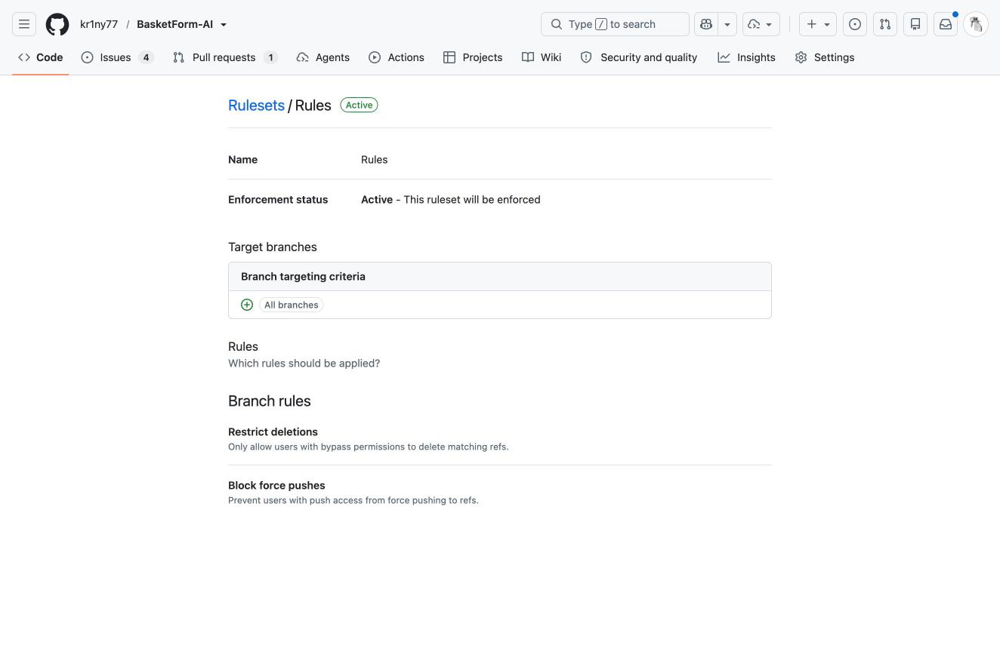
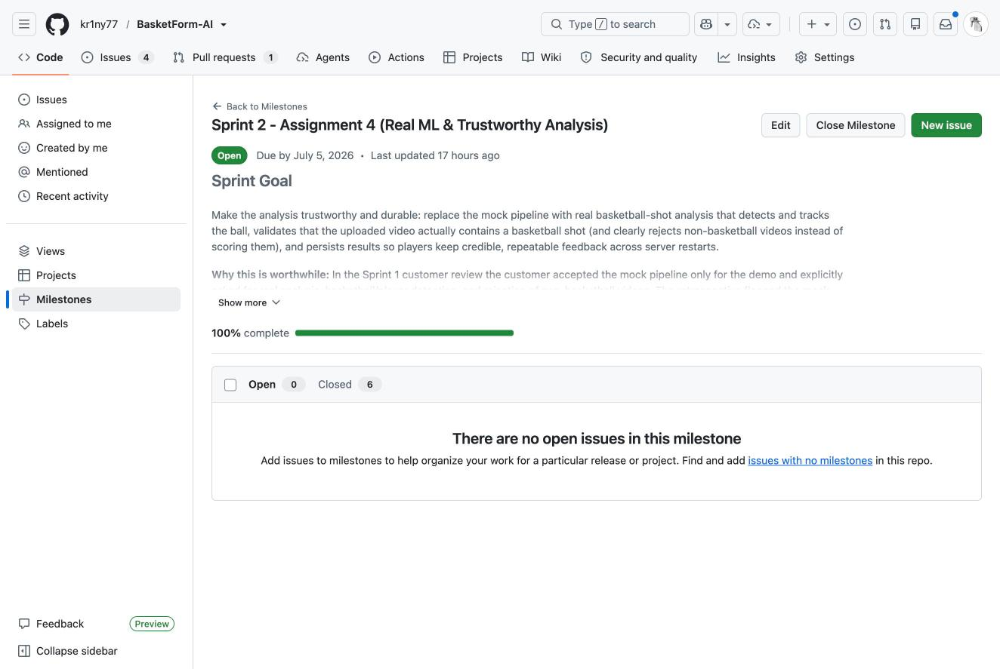
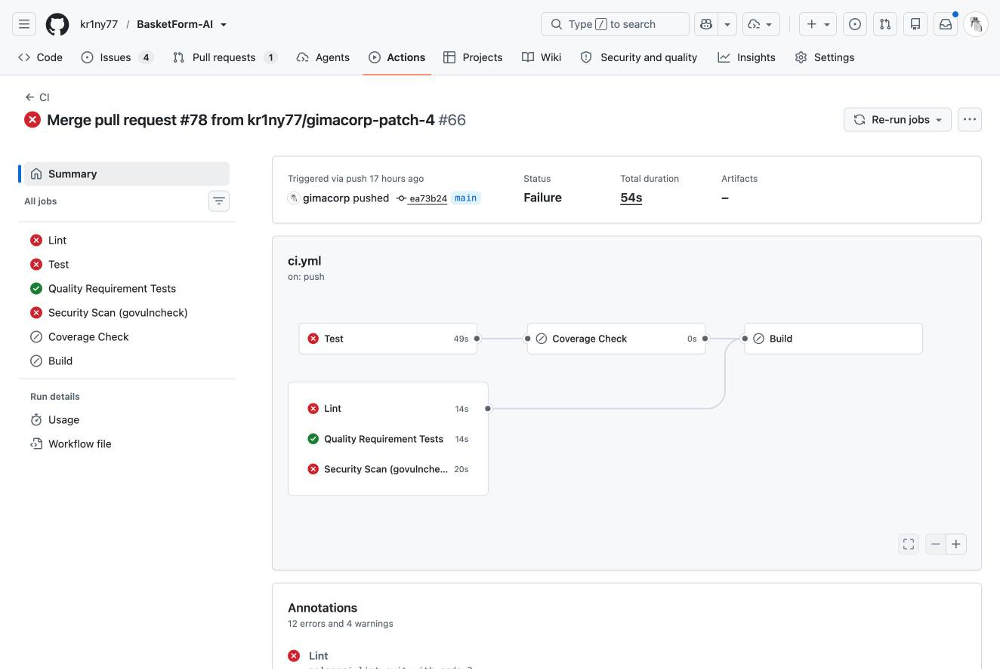
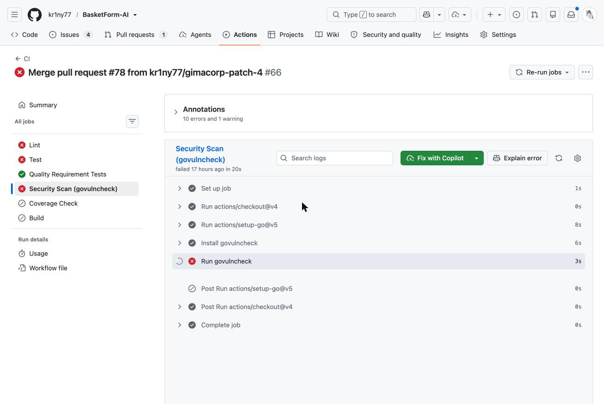
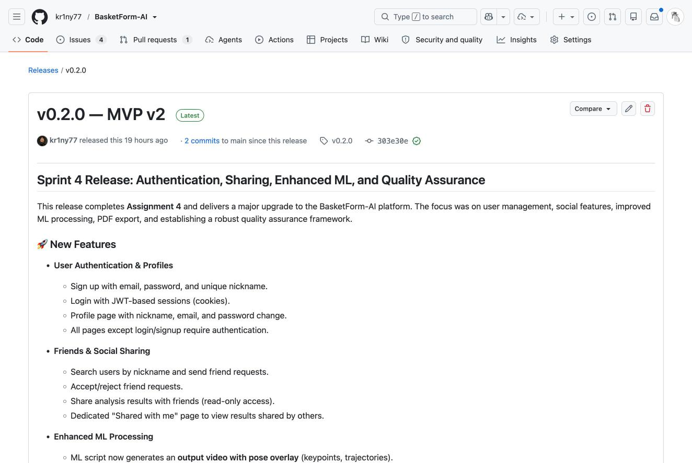
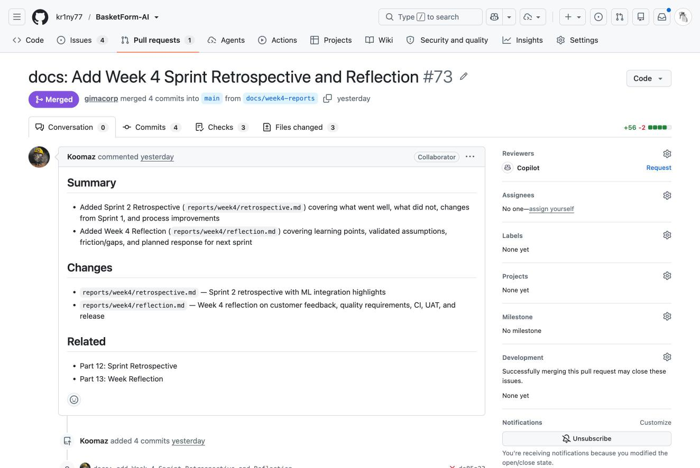

# Week 4 Public Report — BasketForm-AI

Project: **BasketForm-AI** — AI-powered basketball shooting form analysis platform.
Deployment: http://80.74.30.14/

## Sprint Context

- **Sprint:** Sprint 2 — Assignment 4 (Auth, Social, ML, Quality)
- **Sprint Goal:** Add authentication, social features, enhanced ML with phase analysis, and automated quality gates.
- **Sprint milestone:** [Sprint 2 - Assignment 4](https://github.com/kr1ny77/BasketForm-AI/milestone/2)
- **Product Backlog board:** [GitHub Projects board](https://github.com/users/kr1ny77/projects/7)
- **Sprint Backlog board:** [Issues view](https://github.com/kr1ny77/BasketForm-AI/issues/views/775)
- **Sprint dates:** 2026-06-29 to 2026-07-05
- **Total Sprint size:** 34 Story Points

## Delivered Product Changes

- User registration and login with email, nickname, password (bcrypt + JWT)
- Friend system: search, request, accept/reject
- Result sharing with friends (read-only)
- Enhanced ML agent with annotated output video and phase analysis (Stance, Arm Angle, Release, Follow-through)
- PDF export with full score breakdown
- Quality requirements (QR-001 to QR-004) following ISO/IEC 25010
- Automated QRT tests (QRT-001 to QRT-004)
- Updated CI pipeline with lint, test, coverage, QRT, govulncheck
- Unit tests (auth: 9 tests) and integration tests (5 tests)

## Deployed Product

- **URL:** http://80.74.30.14/
- **Run instructions:** See [README.md](../../README.md)
- **Public sanitized demo video:** _Pending publication — link to be added before submission._

## Customer Feedback Response Table

| Feedback point | Resulting PBI or issue | Status | Response |
|---|---|---|---|
| Real ML analysis needed; mock pipeline is only acceptable for demo. | [#64](https://github.com/kr1ny77/BasketForm-AI/issues/64) (PBI-016) | Done | Replaced mock with real MediaPipe pipeline generating annotated video and phase scores. |
| Reject non-basketball videos instead of scoring them. | [#65](https://github.com/kr1ny77/BasketForm-AI/issues/65) (PBI-017) | Done | Added player detection; non-basketball videos get rejected. |
| Authentication and data persistence across restarts. | [#66](https://github.com/kr1ny77/BasketForm-AI/issues/66) (PBI-018) | Done | Added JWT auth, bcrypt, JSON file persistence in data/ directory. |
| Share results with coaches/friends. | [#67](https://github.com/kr1ny77/BasketForm-AI/issues/67) (PBI-019) | Done | Added friend system and result sharing with read-only access. |
| PDF export for offline record-keeping. | [#70](https://github.com/kr1ny77/BasketForm-AI/issues/70) (PBI-022) | Done | Implemented jsPDF-based PDF export with full score breakdown. |
| Batch upload for multiple shots. | [#71](https://github.com/kr1ny77/BasketForm-AI/issues/71) (PBI-023) | Not planned | Deferred; depends on real ML and persistence landing first. |

## Feedback Not Addressed

- Batch upload (PBI-023): Deferred to a later Sprint. Depends on real ML pipeline stability and persistence being fully validated.

## Project Documentation Links

- [Roadmap](../../docs/roadmap.md)
- [Definition of Done](../../docs/definition-of-done.md)
- [Quality Requirements](../../docs/quality-requirements.md)
- [Quality Requirement Tests](../../docs/quality-requirement-tests.md)
- [Testing Strategy](../../docs/testing.md)
- [User Acceptance Tests](../../docs/user-acceptance-tests.md)
- [CHANGELOG](../../CHANGELOG.md)

## Week 4 Report Documents

- [Customer Review Summary](./customer-review-summary.md)
- [Customer Review Transcript](./customer-review-transcript.md)
- [Reflection](./reflection.md)
- [Retrospective](./retrospective.md)
- [LLM Usage Report](./llm-report.md)

## Quality Model

ISO/IEC 25010 sub-characteristics addressed:
- **QR-001:** Time Behaviour (API response < 2s)
- **QR-002:** Confidentiality (auth security, no cross-user access)
- **QR-003:** Testability (30% coverage for critical modules)
- **QR-004:** Usability (form guidance via placeholders/labels)

## Testing Status

| Test type | Status | Evidence |
|---|---|---|
| Unit tests | Passing locally | [internal/handlers](https://github.com/kr1ny77/BasketForm-AI/tree/main/internal/handlers), [internal/services](https://github.com/kr1ny77/BasketForm-AI/tree/main/internal/services) |
| Integration tests | Passing locally | [internal/handlers](https://github.com/kr1ny77/BasketForm-AI/tree/main/internal/handlers) |
| QRTs (QRT-001 to QRT-004) | Passing locally | [internal/qrt](https://github.com/kr1ny77/BasketForm-AI/tree/main/internal/qrt) |
| Coverage (services, handlers) | ≥30% target | See CI Coverage Check job |

### Test Locations

- **Unit tests:** [internal/handlers](https://github.com/kr1ny77/BasketForm-AI/tree/main/internal/handlers), [internal/services](https://github.com/kr1ny77/BasketForm-AI/tree/main/internal/services)
- **Integration tests:** [internal/handlers](https://github.com/kr1ny77/BasketForm-AI/tree/main/internal/handlers)
- **Automated quality requirement tests:** [internal/qrt](https://github.com/kr1ny77/BasketForm-AI/tree/main/internal/qrt)

## CI Pipeline

- **Workflow:** [CI workflow runs (main)](https://github.com/kr1ny77/BasketForm-AI/actions?query=branch%3Amain)
- **Latest protected-default-branch CI run:** [CI #66 (commit ea73b24)](https://github.com/kr1ny77/BasketForm-AI/actions/runs/28333944468)
- Lint: golangci-lint
- Test: go test -race -coverprofile
- Coverage: 30% threshold for critical modules
- QRT: go test -tags=qrt
- QA Extra: govulncheck (security)
- Link Check: Lychee

> **Note:** The latest protected-default-branch CI run (CI #66) is currently **failing** (Lint and Test jobs). This must be fixed in the product code before submission, as Assignment 4 requires the latest protected-default-branch CI run to pass.

## Branch Protection

The default branch `main` is protected by repository rulesets requiring pull requests, status checks, and review before merge.

- **Branch ruleset:** [Repository rules for main](https://github.com/kr1ny77/BasketForm-AI/rules/17658188)
- **Settings:** [Repository rulesets](https://github.com/kr1ny77/BasketForm-AI/rules)
- Screenshot evidence: see  below.

## SemVer Release

- **Release:** [v0.2.0 — MVP v2](https://github.com/kr1ny77/BasketForm-AI/releases/tag/v0.2.0)
- **Tag:** v0.2.0
- **Maps to:** Sprint 2 — Assignment 4 (linked to [Sprint milestone](https://github.com/kr1ny77/BasketForm-AI/milestone/2))

## UAT Results Summary

Week 4 UAT execution covered at least three active end-user scenarios from [docs/user-acceptance-tests.md](../../docs/user-acceptance-tests.md).

- **Passed scenarios:** upload and analysis, account creation/login, result sharing with friends.
- **Scenarios needing changes:** none blocking; minor usability feedback captured as backlog items.
- See [Customer Review Summary](./customer-review-summary.md) for full details (sanitized).

## Quality Gates Continuity

The automated tests, CI checks, quality requirement tests, and Definition of Done created in Assignment 4 are maintained project assets. Later PBIs must keep these gates passing (or extend them) and must not bypass, disable, or treat them as one-time submission evidence.

## Contribution Traceability

| Team member | Area of contribution |
|---|---|
| [@kr1ny77](https://github.com/kr1ny77) | Backend, ML integration, CI configuration, releases |
| [@Koomaz](https://github.com/Koomaz) | Backend, handlers, tests |
| [@romasntlv](https://github.com/romasntlv) | ML / ball tracking, UAT, customer review docs |
| [@gimacorp](https://github.com/gimacorp) | Documentation, reports, deployment |
| [@mentalafffection](https://github.com/mentalafffection) | Frontend, quality requirements |

> Per-issue/PR mapping to be finalized; see the [Product Backlog board](https://github.com/users/kr1ny77/projects/7) and [closed PRs](https://github.com/kr1ny77/BasketForm-AI/pulls?q=is%3Apr+is%3Aclosed) for detailed traceability.

## Screenshots

> The sanitized evidence screenshots below are stored in `reports/week4/images/`. The CI run and QA-check screenshots reflect the current (failing) state of the latest protected-default-branch run.

- Sprint milestone: 
- Latest protected-default-branch CI run: 
- Branch protection / rules evidence: 
- Coverage / test report: 
- Additional QA check result: 
- SemVer release: 
- Example reviewed issue-linked PR: 

## Current Product Status

BasketForm-AI now has a complete authentication system, social features (friends and result sharing), an enhanced ML pipeline with annotated video output and phase analysis, PDF export, and automated quality gates in CI. The product is deployed at http://80.74.30.14/.

## Next Steps

- Fix the failing Lint and Test jobs so the protected-default-branch CI run passes before submission.
- Publish the public sanitized demo video and link it here and from the v0.2.0 release.
- Sprint 3: Comparison with professional players, progress tracking over time.
- Performance optimization for large video files.
- Additional QA checks (accessibility, API contract testing).
