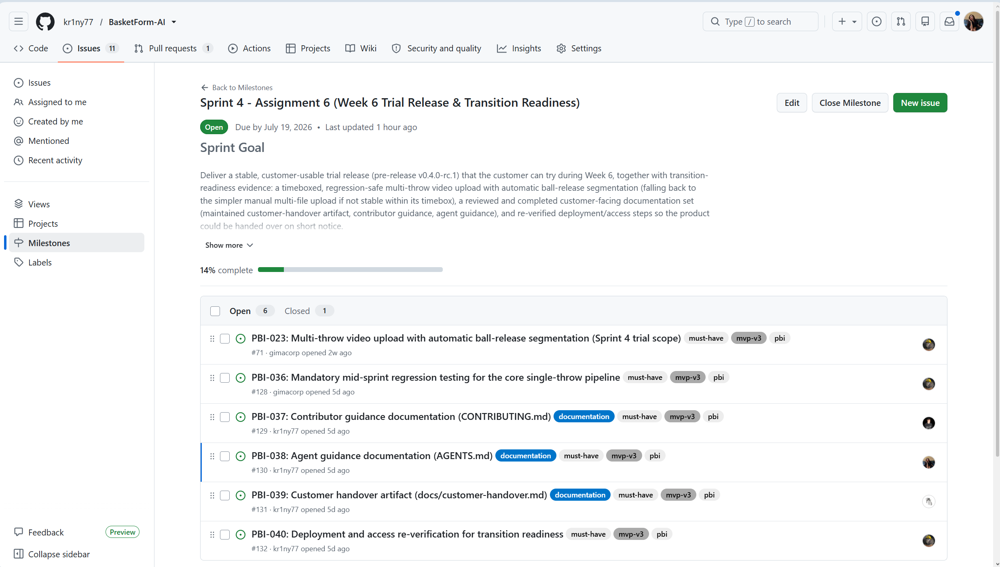
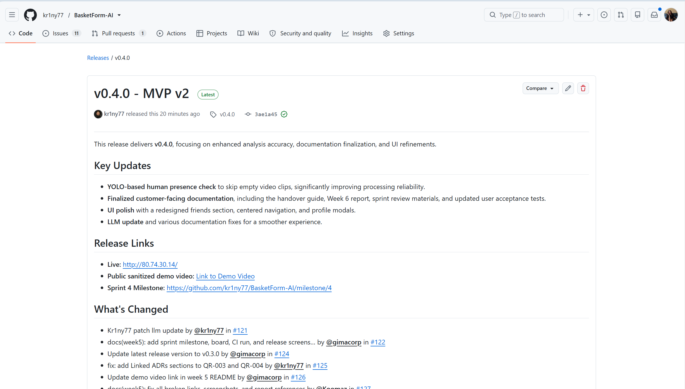
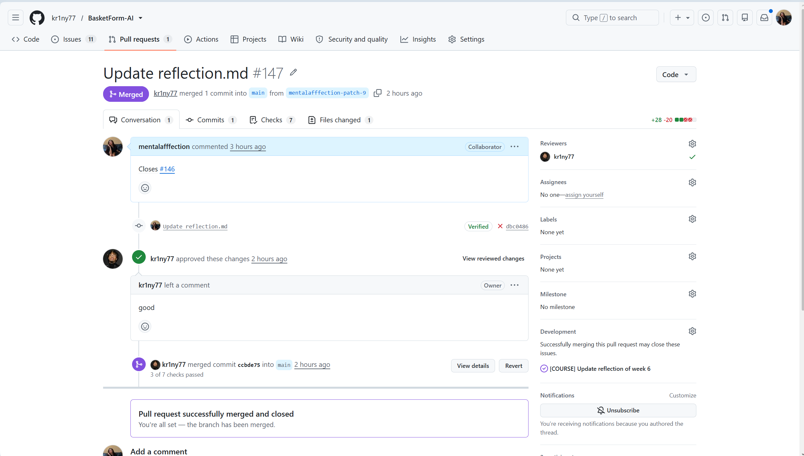

# Week 6 Report — Sprint 4

## Project

**BasketForm-AI** — AI-powered basketball shooting form analysis platform.

- **Product Backlog:** [BasketForm-AI Product Backlog](https://github.com/users/kr1ny77/projects/7)
- **Sprint 4 Backlog:** [Sprint Backlog view](https://github.com/users/kr1ny77/projects/7/views/2)
- **Sprint 4 Milestone:** [Sprint 4](https://github.com/kr1ny77/BasketForm-AI/milestone/4)

## Sprint 4 Summary

**Sprint Goal:** Deliver a stable, customer-usable trial release (pre-release v0.4.0-rc.1) together with transition-readiness evidence: a completed customer-facing documentation set, and re-verified deployment/access steps so the product could be handed over on short notice.

**Sprint Dates:** 2026-07-13 to 2026-07-19

**Total Story Points:** 28

**Scope Summary:** Multi-throw video upload with automatic ball-release segmentation (deferred due to complexity), person-detection validation to reject videos without a human, regression testing for the core pipeline, contributor and agent guidance documentation, customer handover artifact, and deployment re-verification.

## Trial Release Changes

The Week 6 trial increment focuses on:

- **Person-detection validation:** Videos without a human are now rejected with a clear error message instead of producing fake analysis results
- **Regression testing:** Mid-sprint testing verified the core single-throw pipeline remains stable
- **Documentation:** CONTRIBUTING.md, AGENTS.md, and docs/customer-handover.md created
- **Deployment verification:** Access steps re-verified for transition readiness

## Product Access

- **Live product:** [http://80.74.30.14/](http://80.74.30.14/)
- **Access instructions:** [Customer Handover Guide](../../docs/customer-handover.md)
- **README:** [README.md](../../README.md)
- **CONTRIBUTING.md:** [CONTRIBUTING.md](../../CONTRIBUTING.md)
- **AGENTS.md:** [AGENTS.md](../../AGENTS.md)
- **Customer Handover:** [docs/customer-handover.md](../../docs/customer-handover.md)
- **Hosted Documentation:** [https://kr1ny77.github.io/BasketForm-AI/](https://kr1ny77.github.io/BasketForm-AI/)

## Customer-Facing Documentation Review

The customer reviewed the updated documentation set during the Week 6 meeting. The documentation includes README.md, CONTRIBUTING.md, AGENTS.md, and docs/customer-handover.md.

**Customer feedback:**
- Documentation is clear and accurate
- Instructions for the new "Share" button and "unable to analyze" error messages are intuitive
- User Guide and README updates reflect the current state of the site

**Resulting PBIs or issues:** None — documentation was accepted as-is.

## Transition-Readiness Summary

| Item | Status | Notes |
|------|--------|-------|
| Source code | Ready | Full repository access |
| Live deployment | Ready | Running at http://80.74.30.14/ |
| Documentation | Ready | All customer-facing docs created |
| User accounts | Ready | Customer account tested |
| Environment variables | Documented | OPENROUTER_API_KEY, JWT_SECRET documented |
| Deployment steps | Verified | Setup, recovery, and verification steps documented |

**What must still happen in Week 7:**
- Final stabilization and regression pass
- Address any remaining bugs found during customer review
- Final documentation updates
- Demo Day preparation

## Customer Feedback Response

| Feedback Point | Resulting Action |
|----------------|------------------|
| Automatic video splitting deferred | Deferred to post-course; manual upload remains |
| Person-detection validation works well | Accepted, no changes needed |
| Site needs optimization and bug fixes | Planned for Sprint 5 |

**Explanation of feedback not yet addressed:**
- Automatic video splitting: Technical complexity exceeded one-sprint timebox; deferred to post-course implementation
- Site optimization: Planned for Sprint 5 (Week 7) as part of final stabilization

## UAT Results

| UAT Scenario | Result | Notes |
|--------------|--------|-------|
| UAT-007: Upload Video Without Human | Passed | Customer confirmed error message displayed correctly |
| UAT-008: Share Analysis Progress with Friend | Passed | Customer confirmed sharing works via Friends tab |

**Most important feedback points:**
- Person-detection validation works as expected
- Friend sharing feature works correctly
- Customer satisfied with overall product state

## Week 6 Release

**Release:** [Sprint 4 Trial Release](https://github.com/kr1ny77/BasketForm-AI/releases) (pre-release v0.4.0-rc.1)

**CHANGELOG:** [CHANGELOG.md](../../CHANGELOG.md)

## Sprint Review

**Transcript:** [sprint-review-transcript.md](sprint-review-transcript.md)
- Sprint Review discussion starts at timecode **00:00:37**
- UAT review starts at timecode **00:02:58**

**Summary:** [sprint-review-summary.md](sprint-review-summary.md)

**Publication status:** Transcript published with customer consent.

## Reflection

**Link:** [reflection.md](reflection.md)

## Retrospective

**Link:** [retrospective.md](retrospective.md)

## LLM Usage Report

**Link:** [llm-report.md](llm-report.md)

## Sanitized demo video
**Link:** https://youtu.be/hMGA_vBBImw

## Quality, Testing, Architecture, and Process Documentation

- [Quality Requirements](../../docs/quality-requirements.md)
- [Quality Requirement Tests](../../docs/quality-requirement-tests.md)
- [Testing Strategy](../../docs/testing.md)
- [Development Process](../../docs/development-process.md)
- [Architecture Overview](../../docs/architecture/README.md)
- [Definition of Done](../../docs/definition-of-done.md)
- [User Stories](../../docs/user-stories.md)
- [Roadmap](../../docs/roadmap.md)

## Current Product Status and Week 7 Follow-Up

The product is stable and ready for the final Week 7 stabilization pass. The core single-throw analysis pipeline is working correctly. Person-detection validation prevents invalid uploads. Documentation is complete and customer-approved.

**Sprint 5 follow-up work:**
- Address any remaining bugs from customer review
- Final stabilization and regression pass
- Documentation updates
- Demo Day preparation
- Final transition confirmation

## Contribution Traceability

| Team Member | Issues | PRs | Review | Testing | Documentation | Transition |
|-------------|--------|-----|--------|---------|---------------|------------|
| ML Engineer | #71, #128-#133 | PRs linked to issues | Reviewed team PRs | UAT execution | CONTRIBUTING.md, AGENTS.md, customer-handover.md | Deployment verification |
| Customer | — | — | — | UAT execution | Documentation review | Feedback provision |

## Screenshots

