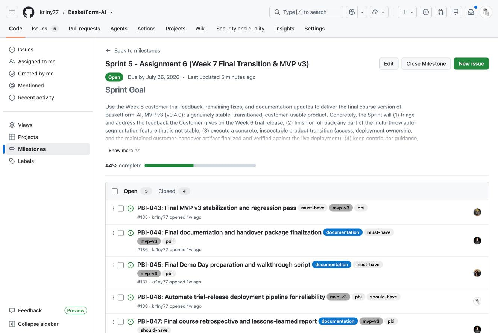
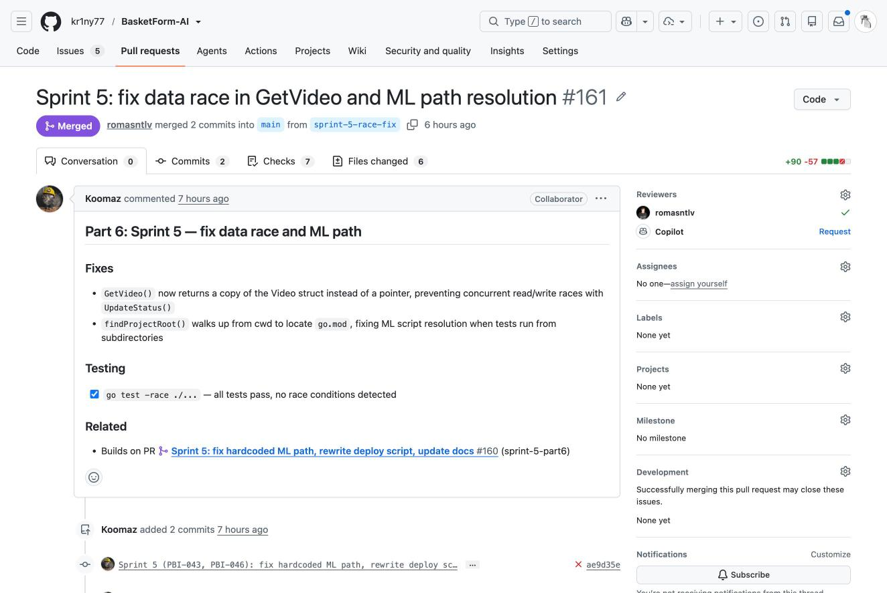
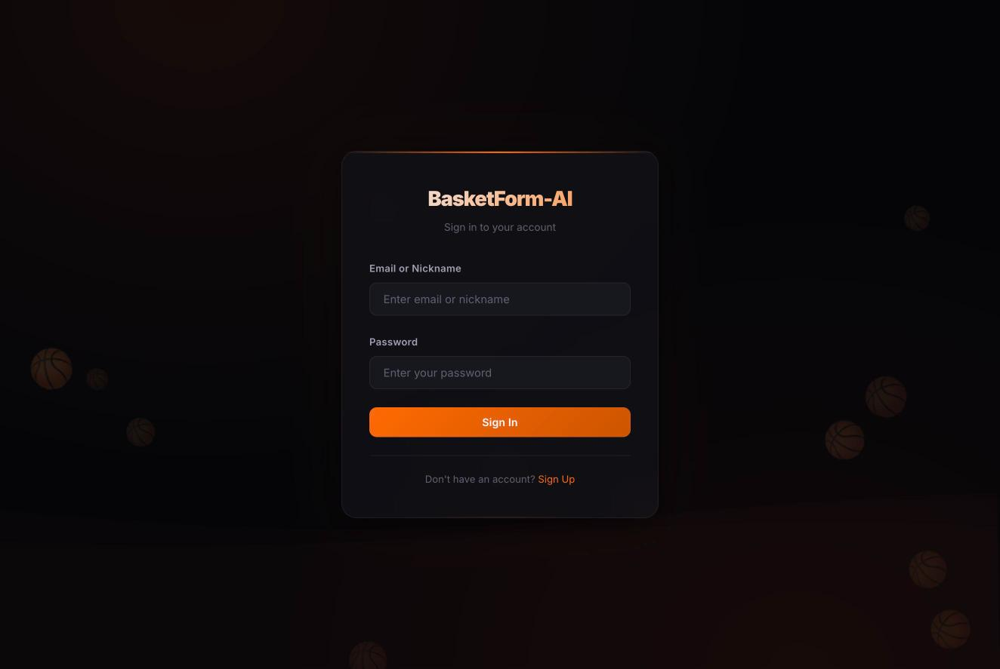
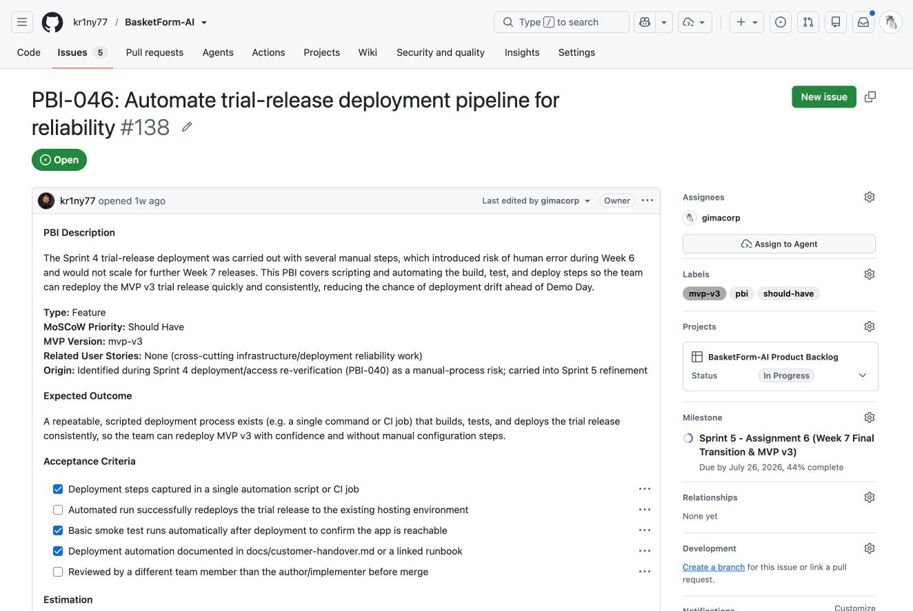
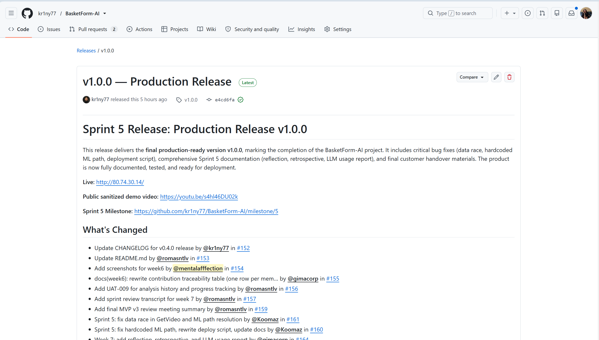

# Week 7 Report — Sprint 5 (Final Transition & MVP v3)

## Project

BasketForm-AI — AI-powered basketball shooting form analysis platform.

This is the final Assignment 6 submission index for Week 7. It covers Sprint 5 follow-up work, the final product transition, and delivery of MVP v3. For the full Week 6 evidence (Sprint 4 trial release, transition-readiness evidence, and the customer-facing documentation review), see [reports/week6/README.md](../week6/README.md).

## Sprint 5 Summary

Product Backlog: [BasketForm-AI Product Backlog](https://github.com/users/kr1ny77/projects/7)

Sprint 5 Backlog: [Sprint Backlog view](https://github.com/users/kr1ny77/projects/7/views/2)

Sprint 5 Milestone: [Sprint 5 — Assignment 6 (Week 7 Final Transition & MVP v3)](https://github.com/kr1ny77/BasketForm-AI/milestone/5)

Sprint Goal: use the Week 6 customer trial feedback, remaining fixes, and documentation updates to deliver the final course version of BasketForm-AI, MVP v3 (v0.5.0): triage and address customer feedback from the Week 6 trial, finish or roll back any unstable part of the multi-throw auto-segmentation feature, execute a concrete and inspectable product transition (access, deployment ownership, and a customer-handover artifact verified against the live deployment), keep contributor, agent, and customer-facing documentation current, and prepare and rehearse the Demo Day presentation.

Sprint Dates: 2026-07-20 to 2026-07-26

Total Sprint 5 Story Points: 28 (PBI-042: 8 SP, PBI-043: 5 SP, PBI-044: 5 SP, PBI-045: 3 SP, PBI-046: 5 SP, PBI-047: 2 SP)

Scope Summary: triage and resolution of Week 6 customer trial feedback, a final MVP v3 stabilization and regression pass, deployment automation for reliable redeploys, final documentation and handover package finalization, Demo Day preparation, and a final course retrospective.

## Week 7 Follow-Up Maintenance and MVP v3 Changes

Sprint 5 has delivered the following follow-up maintenance so far, tracked in the [v0.5.0] section of [CHANGELOG.md](../../CHANGELOG.md):

- Removed a hardcoded deployment path from the ML processor so the product is portable, fixing test failures caused by it (PBI-043)
- Fixed a data race in the video-status handler and made ML script path resolution robust when tests run from subdirectories (PBI-043)
- Rewrote the production deploy script with ML dependency installation, a post-deploy smoke test, and error handling (PBI-046)
- Updated docs/customer-handover.md and docs/roadmap.md to reflect current Sprint 5 status

The remaining Sprint 5 scope — a final regression-pass report, the full documentation-finalization pass, the Demo Day script and rehearsal, and the final course retrospective — is tracked on the [Sprint 5 milestone](https://github.com/kr1ny77/BasketForm-AI/milestone/5) and must be completed before the final MVP v3 release is cut.

## Product Access

Final product access (same VM used since Week 6): [http://80.74.30.14/](http://80.74.30.14/)

Run and access instructions: [docs/customer-handover.md](../../docs/customer-handover.md)

[README.md](../../README.md)

[CONTRIBUTING.md](../../CONTRIBUTING.md)

[AGENTS.md](../../AGENTS.md)

[docs/customer-handover.md](../../docs/customer-handover.md)

Hosted documentation site: https://kr1ny77.github.io/BasketForm-AI/

## Final Transition Outcome

Handover level reached: Independently used by customer. During the Week 7 final meeting, the customer independently uploaded two shot videos in sequence, using only written guidance from the team rather than live step by step direction, and correctly verified the progress-tracking feature (best score, average score, and chart update).

Customer-confirmation status: Accepted with follow-up items. The customer confirmed the product meets requirements and expressed high satisfaction with the team's speed and quality; the remaining follow-up items are optional (a suggested UI hint about the recommended camera angle, and the previously-deferred automatic video-splitting feature), not blocking issues.

See [docs/customer-handover.md](../../docs/customer-handover.md) for the full transferred, delegated, and retained breakdown, environment variable and configuration notes, and known limitations current as of Sprint 5.

### Remaining Transition Items

- Recommended camera-angle UI hint (side-view instruction shown before or during upload processing) — suggested by the customer as a nice-to-have, not required for handover
- Automatic multi-shot video splitting — previously deferred; documented as a known limitation
- The final regression-pass report and Demo Day preparation are still in progress under the Sprint 5 milestone

## Customer Feedback Response (Sprint 5)

| Feedback Point | Resulting Action |
|---|---|
| Recommend showing the optimal camera angle (side view) before or during upload | Considered as a UI improvement; tracked as an optional follow-up, not required for handover |
| Automatic video splitting still not implemented | Confirmed as a known, previously-deferred limitation; documented in customer-handover.md |
| Player comparison feature | Rejected earlier in the project; out of scope |
| Overall product speed, quality, and functionality | Positive confirmation, no action needed |

## Week 7 UAT / Customer-Trial Results

UAT-009: View Analysis History and Progress Tracking — Passed. During the Week 7 final meeting, the customer independently uploaded two videos and confirmed the best score, average score, latest result, and progress chart updated correctly. See [sprint-review-transcript.md](sprint-review-transcript.md).

## Release and Changelog

Final SemVer release mapped to MVP v3: https://github.com/kr1ny77/BasketForm-AI/releases/tag/v1.0.0

[CHANGELOG.md](../../CHANGELOG.md) — the [v1.0.0] section has been drafted with the Sprint 5 changes delivered so far.

## Demo Day Preparation

The required Week 7 lab rehearsal preparation (demo script, dry run, fallback plan) is is completed. 

## Sprint Review

Transcript: [sprint-review-transcript.md](sprint-review-transcript.md) (published with customer consent)

Summary: [sprint-review-summary.md](sprint-review-summary.md)

## Reflection, Retrospective, and LLM Usage

### Reflection

Link: [reflection.md](reflection.md)

### Retrospective

Link: [retrospective.md](retrospective.md)

### LLM Usage Report

Link: [llm-report.md](llm-report.md)

## Public Sanitized Demo Video

Link: https://youtu.be/s4hl46DU02k

## Current Product Status

MVP v3 (v1.0.0) is fully stabilized and released. Sprint 5 successfully resolved the hardcoded-path and data-race issues found during follow-up testing, rewrote the deployment script, and finalized all customer-facing documentation. The product is live at http://80.74.30.14/ and has been independently validated by the customer (UAT-009 Passed).

## Contribution Traceability

| Team Member | Issues | PRs | Review | Notes |
|---|---|---|---|---|
| Koomaz | PBI-043 (#135, implementer), PBI-046 (#138, implementer) | #160, #161, #168 | Reviewed and approved by romasntlv | Hardcoded ML path fix, data race fix, deploy script rewrite, plus the PBI-043 regression report and Should-Have bug triage |
| romasntlv | PBI-043 (#135, reviewer), PBI-046 (#138, reviewer), PBI-047 (#139, implementer) | Reviewed/approved #160, #161, #168; merged #167 | Approved Koomaz's Sprint 5 fixes and regression/triage docs | Also merged PBI-044's final handover PR (#167); PBI-047 (final course retrospective) not yet started (To Do) |
| gimacorp | PBI-044 (#136, implementer), PBI-042 (#134, reviewer) | #162, #163, #164, #165, #167 | #162 and #163 reviewed by kr1ny77; #167 reviewed and merged by romasntlv | Week 7 report, handover-level update, reflection/retrospective/LLM report, and evidence screenshots; also reviewer on the reopened PBI-042 |
| kr1ny77 | PBI-042 (#134, implementer, reopened), PBI-044 (#136, reviewer), PBI-047 (#139, reviewer) | — | Approved #162, #163 | Reopened PBI-042 after it was found closed with no linked evidence and is documenting the actual (light) Week 6 feedback triage; reviewer assigned for PBI-047 |
| mentalafffection | PBI-045 (#137, implementer) | — | — | Demo Day preparation is completed |
| Customer | — | — | UAT-009 execution | Independent progress-tracking UAT (Passed), final feedback |

This table reflects final Sprint 5 attribution, cross-checked against the current Implementer/Reviewer fields on issues #134–#139 and the merged PRs #160, #161, #162, #163, #164, #165, #167, and #168.

## Screenshots

Sprint 5 milestone view showing PBI-042 through PBI-047 and overall completion percentage.

PR #161, linked to PBI-043/PBI-046, showing a recorded reviewer approval from a team member other than the author.

The deployed product's login page at http://80.74.30.14/, confirming the final product access point is reachable.

PBI-046 (#138) after the Sprint 5 backlog audit: Project Status updated to In Progress and the acceptance-criteria checkboxes that are genuinely met are checked.

